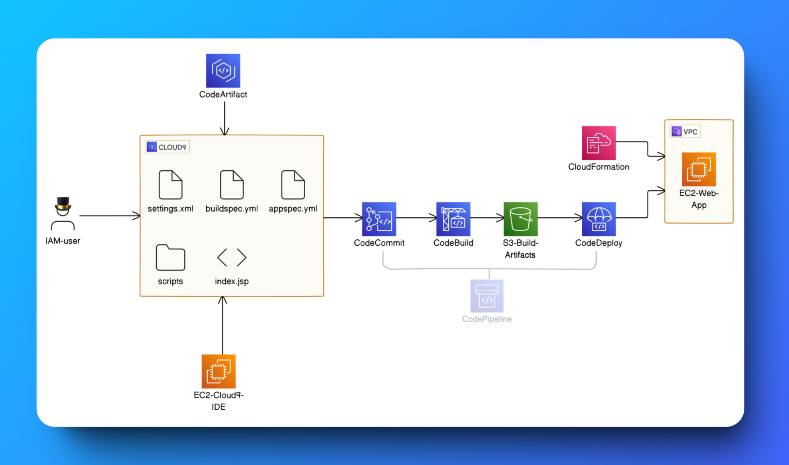

# AWS Cloud9 CI/CD Pipeline



## Overview
This repository contains a CI/CD (Continuous Integration/Continuous Deployment) pipeline implementation using AWS services for deploying a web application. The pipeline automates the build and deployment process from source code to a production environment.

## Architecture
The pipeline consists of the following components:

- **Source Control**: AWS Cloud9 IDE for development
- **Build & Deploy**: AWS CodePipeline with CodeBuild and CodeDeploy
- **Infrastructure**: AWS CloudFormation for infrastructure as code
- **Hosting**: EC2 instances within a VPC

## Pipeline Flow
1. Developer pushes code through IAM-authenticated user
2. Code is stored in Cloud9 environment with configuration files:
   - `settings.xml`: Maven/project settings
   - `buildspec.yml`: Build specifications for CodeBuild
   - `appspec.yml`: Application specifications for CodeDeploy
   - `scripts/`: Deployment scripts
   - `index.jsp`: Main application file

3. Pipeline Stages:
   - CodeCommit: Source code version control
   - CodeBuild: Compiles and tests the application
   - S3-Build-Artifacts: Stores build artifacts
   - CodeDeploy: Deploys to EC2 instances
   - CloudFormation: Manages infrastructure

## Prerequisites
- AWS Account with appropriate permissions
- IAM user with necessary roles
- Basic knowledge of AWS services
- Java/JSP development environment

## Setup Instructions
1. Clone this repository
2. Configure AWS credentials
3. Update configuration files:
   ```
   settings.xml
   buildspec.yml
   appspec.yml
   ```
4. Deploy infrastructure using CloudFormation template
5. Set up CodePipeline using the provided configurations

## Configuration Files
### buildspec.yml
Defines the build process including:
- Dependencies installation
- Build commands
- Test execution
- Artifact packaging

### appspec.yml
Specifies the deployment process:
- Source files mapping
- Permissions
- Deployment scripts execution order
- Validation tests

## Security
- All resources are deployed within a VPC
- IAM roles and policies control access
- Secure communication between services
- Encrypted artifact storage in S3

## Best Practices
- Use version control for all code changes
- Test thoroughly before deployment
- Monitor pipeline execution
- Maintain proper documentation
- Follow AWS security best practices

## Troubleshooting
Common issues and solutions:
- Pipeline execution failures: Check CloudWatch logs
- Deployment failures: Verify EC2 instance permissions
- Build errors: Review buildspec.yml configuration

## Contributing
 1. Fork the repository
 2. Create a feature branch
 3. Submit a pull request
 4. Ensure tests pass
 5. Update documentation

## Contact
dev.abdullah21@gmail.com

